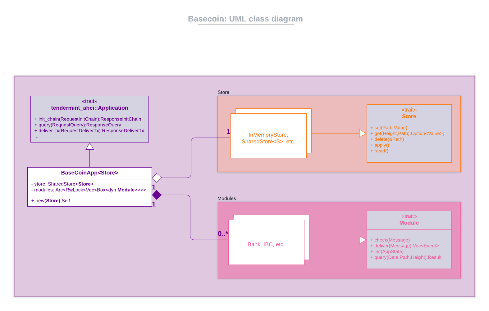

# basecoin-rs
A rudimentary Tendermint ABCI application that implements the following functionality in the form of modules - 
* `bank` - keeps track of different accounts' balances and facilitates transactions between those accounts.
* `ibc` - enables support for IBC (clients, connections & channels)

## Requirements
So far this app has been tested with:
* Rust >v1.52.1
* Tendermint v0.34.10

## Usage
### Step 1: Reset your local Tendermint node.
```bash
tendermint unsafe-reset-all
```

### Step 2: Module specific setup
See the module documentation for more details -
* [Bank module](docs/modules/bank.md)
* [Ibc module](docs/modules/ibc.md)

### Step 3: Run the basecoin app and Tendermint
```bash
# See all supported CLI options
$ cargo run -- --help
tendermint-basecoin 0.1.0

USAGE:
    tendermint-basecoin [FLAGS] [OPTIONS]

FLAGS:
        --help       Prints help information
    -q, --quiet      Suppress all output logging (overrides --verbose)
    -V, --version    Prints version information
    -v, --verbose    Increase output logging verbosity to DEBUG level

OPTIONS:
    -g, --grpc-port <grpc-port>            Bind the gRPC server to this port [default: 9093]
    -h, --host <host>                      Bind the TCP server to this host [default: 127.0.0.1]
    -p, --port <port>                      Bind the TCP server to this port [default: 26658]
    -r, --read-buf-size <read-buf-size>    The default server read buffer size, in bytes, for each incoming client
                                           connection [default: 1048576]

# Run the ABCI application (from this repo)
# The -v is to enable trace-level logging
cargo run -- -v

# In another terminal
tendermint node 
```

## UML diagram

