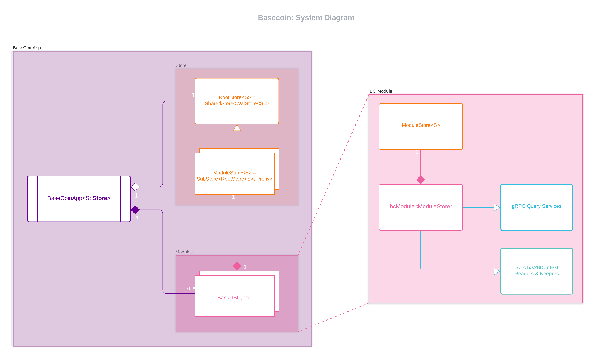
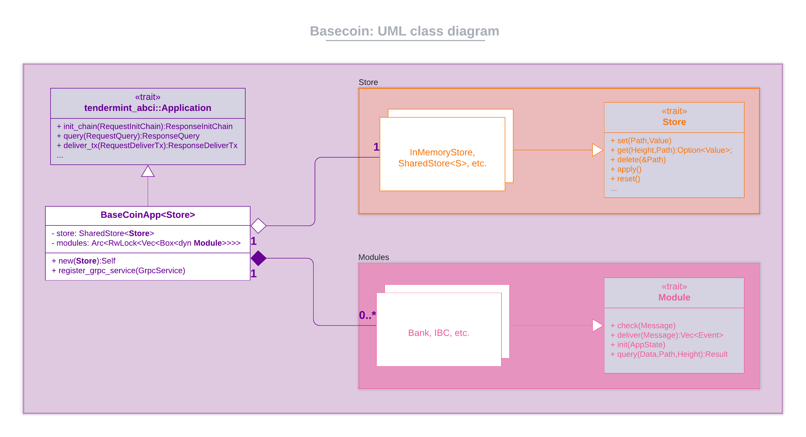
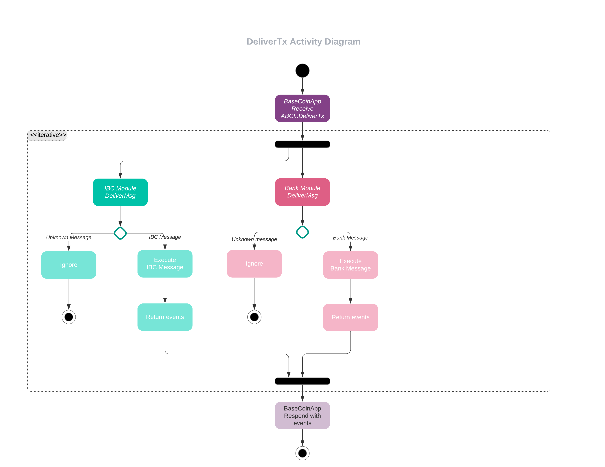

# basecoin-rs
At a high level, basecoin implements the application logic that sits between the Tendermint consensus layer and ibc-rs.
It is a rudimentary Tendermint ABCI application that implements the following functionality in the form of modules -
* `bank` - keeps track of different accounts' balances and facilitates transactions between those accounts.
* `ibc` - enables support for IBC (clients, connections & channels)

Its main use-cases are serving as a testing ground and mock implementation for verifying the correctness and behaviour
of the ibc-rs modules. 

## Requirements
So far this app has been tested with:
* Rust >v1.52.1
* CometBFT v0.37

## How to integrate ibc-rs changes into basecoin
Since basecoin serves as a suite of integration tests against ibc-rs's functionality, each ibc-rs
PR also requires an accompanying basecoin PR. The steps to do this are:
1. In a new branch in basecoin, update ibc [revisions][revs] with the latest commit of the ibc-rs PR.
2. Implement the necessary changes in basecoin in order to get it working with the latest commit revision of ibc-rs.
3. Run `cargo clippy --all-features` and `cargo clippy --no-default-features` and fix any issues that clippy raises.
4. Open a PR in the basecoin-rs repository, making sure to the link to the associated ibc-rs PR.
5. Check to see if the [integration tests][integration-tests] pass.

## Starting up an instance of basecoin
### Step 1: Reset your local CometBFT node
```shell
$ cometbft init
$ cometbft unsafe-reset-all
```

### Step 2: Modify CometBFT config
Edit the CometBFT `config.toml` file (default location `~/.cometbft/config/config.toml`) to update the `proxy_app` and P2P `laddr` as follows.
```toml
proxy_app = "tcp://127.0.0.1:26358"
# ...
[p2p]
laddr = "tcp://0.0.0.0:26356"
```

### Step 3: Module specific setup
See the module documentation for more details -
* [Bank module](docs/modules/bank.md)
* [Ibc module](docs/modules/ibc.md)

### Step 4: Run the basecoin app and CometBFT
```shell
# See all supported CLI options
$ cargo run -- --help
basecoin 0.1.0

USAGE:
    basecoin [FLAGS] [OPTIONS]

FLAGS:
        --help       Prints help information
    -q, --quiet      Suppress all output logging (overrides --verbose)
    -V, --version    Prints version information
    -v, --verbose    Increase output logging verbosity to DEBUG level

OPTIONS:
    -g, --grpc-port <grpc-port>            Bind the gRPC server to this port [default: 9093]
    -h, --host <host>                      Bind the TCP server to this host [default: 127.0.0.1]
    -p, --port <port>                      Bind the TCP server to this port [default: 26658]
    -r, --read-buf-size <read-buf-size>    The default server read buffer size, in bytes, for each incoming client
                                           connection [default: 1048576]

# Run the ABCI application (from this repo)
# The -v is to enable trace-level logging
$ cargo run -- -v

# In another terminal
$ cometbft node
```

## UML diagrams

---

---


[revs]: https://github.com/informalsystems/basecoin-rs/blob/9610b29067ba122808d1d14354a32e2005b54517/Cargo.toml#L15-L16
[integration-tests]: https://github.com/informalsystems/basecoin-rs/blob/8f744c8356569d5f87a546f46d1ade247ebe5256/.github/workflows/integration.yml#L1